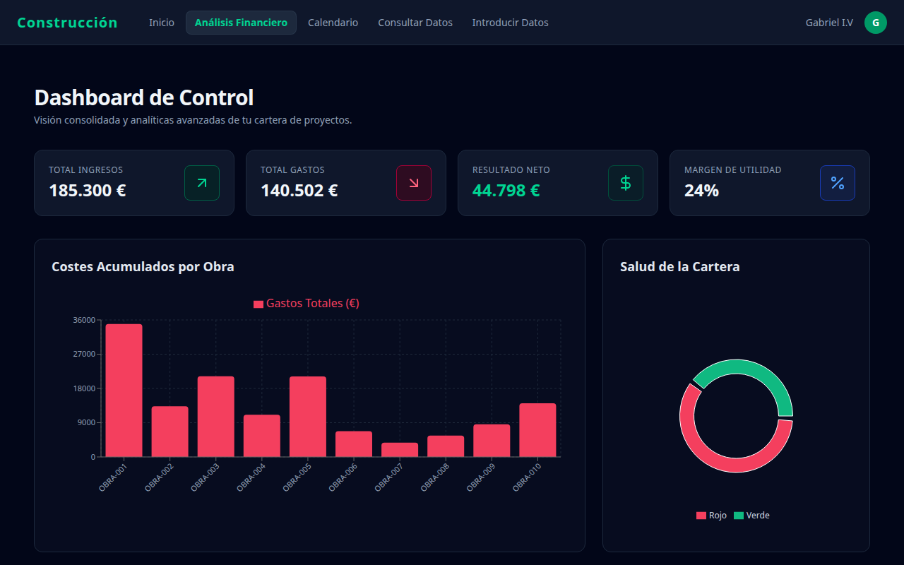
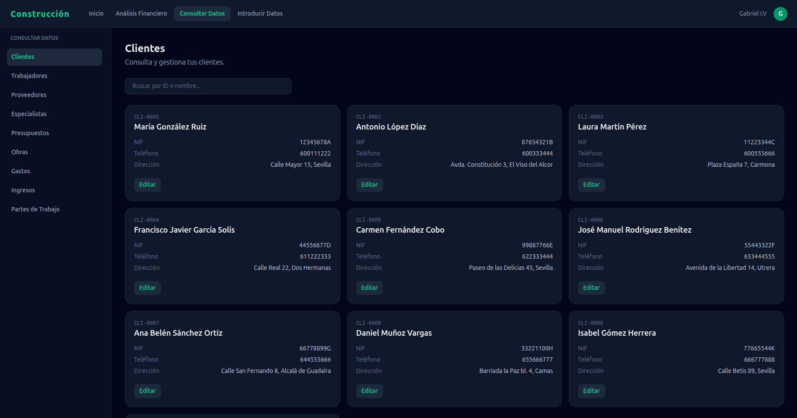
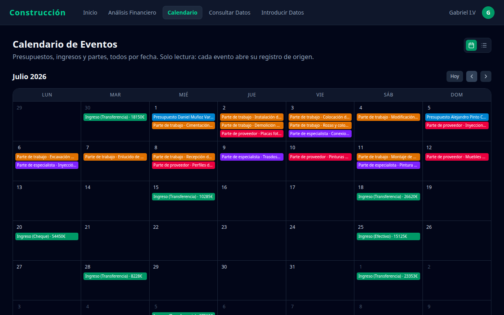
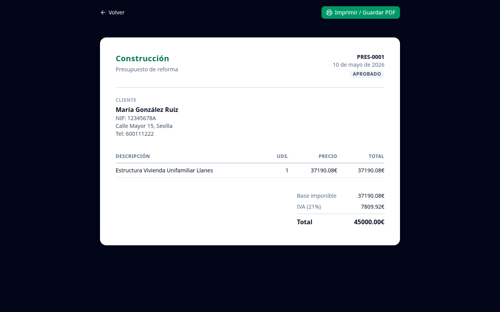
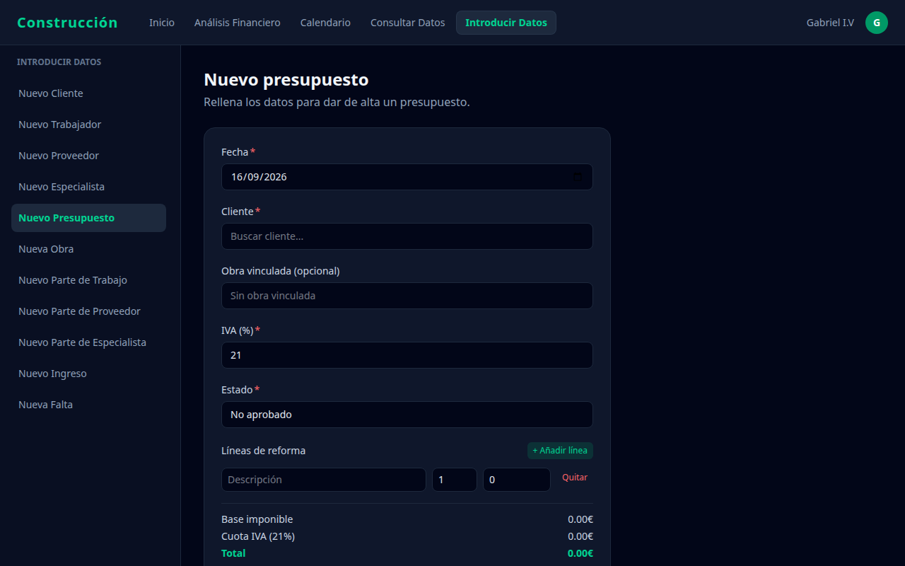

<a id="inicio"></a>

# ERP Construcción - Sistema de Gestión Modular

Un sistema ERP moderno, fluido y totalmente responsivo para la gestión integral de una constructora: clientes, obras, presupuestos, partes de trabajo, proveedores, especialistas, gastos, ingresos y calendario, con análisis financiero en tiempo real. Desarrollado con **React**, **TypeScript** y **Tailwind CSS**.

El modelo de negocio, con sus 13 entidades (Clientes, Obras, Presupuestos, Partes de trabajo...), está basado en un desarrollo real hecho a medida para un cliente sobre **Odoo**, adaptando aquí su lógica y su ciclo de negocio completo a una versión 100% frontend, portable y de acceso público — incluyendo vistas de tarjetas/lista, registros relacionados, calendario tipo Google Calendar, autocompletado en los selectores de relación y exportación a PDF de los documentos principales.

Este proyecto está enfocado puramente en el **Desarrollo Frontend**, demostrando buenas prácticas de renderizado rápido, interfaces reactivas y un control de estado riguroso. Para facilitar su portabilidad y testeo ágil, **la aplicación prescinde de una base de datos física o un backend tradicional**; toda la persistencia de datos se gestiona localmente en el navegador a través de **localStorage** (con control de versión para evitar datos obsoletos), apoyándose en un ecosistema de **datos simulados (mocks)** preestablecidos para una experiencia de usuario fluida desde el primer segundo.

**[Ver demo en vivo](https://dashboard-financiero-kappa-blue.vercel.app/)**

## Capturas
[⬆ Volver arriba](#inicio)

<table>
  <tr>
    <td align="center"><b>Dashboard financiero</b></td>
    <td align="center"><b>Gestión CRUD (vista de tarjetas)</b></td>
  </tr>
  <tr>
    <td></td>
    <td></td>
  </tr>
  <tr>
    <td align="center"><b>Calendario mensual</b></td>
    <td align="center"><b>Exportación a PDF</b></td>
  </tr>
  <tr>
    <td></td>
    <td></td>
  </tr>
</table>

<details>
<summary>Formulario</summary>



</details>

## Índice

*   [Capturas](#capturas)
*   [Características Clave](#características-clave)
*   [Modelo de Datos](#modelo-de-datos)
*   [Exportación a PDF](#exportación-a-pdf)
*   [Módulo de Análisis Financiero (Dashboard)](#módulo-de-análisis-financiero-dashboard)
*   [Sistema de Notificaciones (useToast)](#sistema-de-notificaciones-usetoast)
*   [Optimización y Buenas Prácticas](#optimización-y-buenas-prácticas)
*   [Stack Tecnológico](#stack-tecnológico)
*   [Estructura del Proyecto](#estructura-del-proyecto)
*   [Despliegue en Producción (Vercel)](#despliegue-en-producción-vercel)
*   [Licencia](#licencia)

---

## Características Clave

*   **Diseño 100% Responsivo:** Interfaz adaptada dinámicamente para móviles, tablets y ordenadores mediante layouts híbridos y menús deslizantes horizontales (`overflow-x-auto`) en Tailwind.
*   **Filtrado Avanzado:** Componente de consulta global (`GridConsulta`) con buscador predictivo por texto y selectores normalizados por estados del ciclo de vida del negocio.
*   **Formularios Dinámicos:** Arquitectura basada en React Hook Form y validación estricta de esquemas en tiempo real con Zod.
*   **Automatización de Cálculos:** Sistema integrado y reactivo para el cálculo automático de importes netos, porcentajes de IVA y totales consolidados de gastos e ingresos.
*   **Gestión de Datos Relacionales:** Cruce automático de IDs (Clientes, Obras, Presupuestos) en la capa de presentación para mostrar información legible en lugar de códigos técnicos.
*   **Vistas Intercambiables (Tarjetas/Lista):** Alternancia entre una vista de tarjetas estilo Odoo y una tabla de lista clásica en todos los listados, con tarjetas totalmente clicables para entrar directamente a la ficha sin pasar por un botón de "editar".
*   **Registros Relacionados:** Cada ficha (Cliente, Obra, Trabajador...) muestra automáticamente sus elementos asociados (presupuestos, partes, gastos...) a modo de "smart buttons", replicando el comportamiento de un ERP como Odoo.
*   **Calendario Mensual:** Vista de calendario tipo Google Calendar, con panel de detalle por día, accesible como pestaña propia en la navegación superior.
*   **Autocompletado en Relaciones:** Los selectores de relación (cliente, obra, trabajador...) usan un combobox buscable en lugar de un `<select>` nativo, para localizar registros con rapidez en catálogos grandes.
*   **Exportación a PDF:** Generación de documentos imprimibles (Presupuesto, Parte de Trabajo, Seguimiento de Gastos) con maquetación propia, ver [Exportación a PDF](#exportación-a-pdf).

---

## Modelo de Datos
[⬆ Volver arriba](#inicio)

La aplicación cubre el ciclo de negocio completo de una constructora, replicando en el frontend el modelo de datos de un ERP real:

| Modelo | Descripción |
| --- | --- |
| **Clientes** | Datos de contacto y fiscales de clientes/promotores. |
| **Trabajadores** | Plantilla interna de la empresa. |
| **Proveedores** | Proveedores de materiales y servicios. |
| **Especialistas** | Profesionales externos subcontratados (arquitectos, electricistas...). |
| **Obras** | Proyectos de construcción, con estado y salud financiera calculados. |
| **Presupuestos** | Líneas de presupuesto por obra, con IVA y totales calculados. |
| **Gastos** | Ficha de seguimiento financiero 1:1 por obra (costes, ingresos, beneficio real). |
| **Ingresos** | Cobros asociados a cada obra. |
| **Partes de Trabajo** | Horas imputadas por los trabajadores a cada obra. |
| **Partes de Especialista** | Horas/servicios imputados por especialistas externos. |
| **Partes de Proveedor** | Suministros/servicios imputados por proveedores. |
| **Faltas de Trabajador** | Registro de ausencias del personal. |
| **Calendario de Eventos** | Eventos y citas asociados a las obras. |

Los campos calculados (`estado`, `salud_obra`, `beneficio_real`...) se derivan en tiempo de lectura a partir de los datos base y nunca se persisten directamente, evitando desincronizaciones en `localStorage`.

---

## Exportación a PDF
[⬆ Volver arriba](#inicio)

Presupuestos, Partes de Trabajo y el informe de seguimiento financiero de Gastos incluyen un botón **"Imprimir"** que abre un documento dedicado en una pestaña nueva, maquetado como un informe de impresión (cabecera, líneas, totales) e independiente del tema oscuro de la aplicación.

* Rutas bajo `/imprimir/*`, renderizadas fuera del layout habitual (sin menú ni barra lateral).
* Exportación a PDF real a través del diálogo nativo `window.print()` del navegador ("Guardar como PDF"), sin dependencias adicionales.
* `@page { margin: 0 }` en modo impresión para evitar que el navegador añada su propia cabecera/pie (URL, fecha, número de página) al documento.

---

## Módulo de Análisis Financiero (Dashboard)
[⬆ Volver arriba](#inicio)

El sistema cuenta con un panel analítico centralizado que procesa los flujos de caja y estados de salud del negocio:

* **Tarjetas de Métricas (KPIs):** Visualización rápida de los principales indicadores del negocio (Total de Ingresos, Gastos Acumulados, Margen de Beneficio y Presupuestos Pendientes).
* **Balance de Pérdidas y Ganancias:** Cálculo reactivo del beneficio neto de la empresa aplicando la fórmula:
    $$Beneficio = \sum Ingresos - \sum Gastos$$
* **Alertas de Desviación Presupuestaria:** Monitorización en tiempo real del presupuesto asignado a las obras frente a los gastos reales imputados mediante partes y facturas, detectando sobrecostes de forma temprana.
* **Control de Flujo de Caja (Cash Flow):** Segmentación del dinero real cobrado/pagado frente al dinero comprometido (facturas en estado *pendiente*).
* **Gráficos Interactivos y Visualización Avanzada:**
  * **Gráfico de Barras (`GraficoBarras`):** Comparativa de ingresos y costes imputados por cada obra en ejecución.
  * **Gráfico de Línea (`GraficoLineaGastos`):** Evolución temporal del volumen de gastos e inversiones a lo largo del tiempo.
  * **Gráfico de Pastel (`GraficoPastelEstado`):** Distribución porcentual del estado de las obras y presupuestos del sistema.

---

## Sistema de Notificaciones (useToast)
[⬆ Volver arriba](#inicio)

Para mantener una experiencia de usuario fluida y reactiva, el proyecto integra un **Contexto de Notificaciones Personalizado manejado a través del hook `useToast`**. Este ecosistema permite lanzar alertas visuales temporales y flotantes desde cualquier componente o página de forma muy sencilla.

### Cómo usarlo en tus vistas o componentes:

1. **Importar el hook personalizado** `useToast` en el archivo donde lo necesites.
2. **Extraer la función** `mostrarToast`.
3. **Invocar la función** pasándole el mensaje de texto deseado tras realizar acciones como crear, editar o eliminar registros.

### Ejemplo práctico de implementación:

```tsx
import { useToast } from "../../../contextos/ToastContext/ToastContext";

export default function MiComponente() {
  // 1. Instanciamos el hook que consume el contexto de notificaciones
  const { mostrarToast } = useToast();

  const handleAccion = () => {
    // ... lógica del negocio (ej. guardar datos) ...

    // 2. Lanzamos la notificación visual flotante
    mostrarToast("¡Operación completada con éxito!");
  };

  return (
    <button onClick={handleAccion} className="bg-emerald-600 text-white p-2 rounded">
      Guardar Registro
    </button>
  );
}
```

---

## Optimización y Buenas Prácticas
[⬆ Volver arriba](#inicio)

*   **Evitamos Rerenders Innecesarios:** Uso intensivo de `useMemo` en los componentes de filtrado (`GridConsulta`) para procesar las búsquedas y cruces de datos relacionales únicamente cuando el array de elementos o el término de búsqueda cambian.
*   **Filtros:** Normalización automática de strings (`.toLowerCase().trim()`) en las búsquedas, haciendo que los filtros por estado sean inmunes a discrepancias entre mayúsculas, minúsculas o espacios accidentales de la base de datos.
*   **Tipado Estricto de Extremo a Extremo:** Cero uso de `any`. Toda la información (desde las entidades del negocio hasta las props del generador de formularios genéricos) está respaldada por tipos rigurosos de TypeScript.
*   **Persistencia Versionada:** Un guard de versión sobre `localStorage` (`CrudService`) limpia automáticamente los datos obsoletos de usuarios recurrentes cuando cambia la forma de los modelos, evitando estados inconsistentes entre sesiones.

---

## Stack Tecnológico
[⬆ Volver arriba](#inicio)

*   **Frontend:** React 19 (Hooks + `useMemo` + `useEffect`)
*   **Lenguaje:** TypeScript (Tipado estricto)
*   **Enrutamiento:** React Router DOM (Manejo dinámico de parámetros de sección)
*   **Formularios & Validación:** React Hook Form + Zod + Resolvers
*   **Gráficos:** Recharts (barras, líneas y pastel)
*   **Iconografía:** lucide-react
*   **Estilos:** Tailwind CSS (Diseño Mobile-First adaptativo)

---

## Estructura del Proyecto
[⬆ Volver arriba](#inicio)

El sistema se organiza bajo una arquitectura limpia y altamente modular basada en carpetas funcionales, separando de forma estricta la interfaz, la lógica de negocio y las páginas dinámicas.

```text
src/
├── componentes/          # Componentes atómicos e independientes de la UI
│   ├── Aside/            # Menú de navegación lateral (adaptable a móvil)
│   ├── Main/             # Contenedor principal de vistas y enrutador (incluye RutasImprimir)
│   ├── Menu/             # Barra de navegación superior con scroll móvil
│   ├── VistaDinamica/    # Renderizador dinámico de componentes por string-key
│   │
│   ├── Dashboard/        # Ecosistema analítico centralizado del Dashboard
│   │   ├── GraficoBarras/          # Comparativa de Ingresos vs. Gastos por Obra
│   │   ├── GraficoLineaGastos/     # Evolución temporal y tendencia de costes
│   │   ├── GraficoPastelEstado/    # Distribución porcentual por estados de obras
│   │   ├── TarjetasKpi/            # Indicadores financieros de alto nivel (KPIs)
│   │   └── UltimosMovimientos/     # Registro contable y transacciones recientes
│   │
│   ├── Calendario/       # Vista de calendario mensual tipo Google Calendar
│   │   └── CalendarioMes/
│   │
│   ├── Imprimir/         # Componentes compartidos de las páginas de impresión/PDF
│   │   ├── BarraAccionesImprimir/  # Barra "Volver / Imprimir"
│   │   └── DocumentoImprimible/    # "Papel" reutilizable de los informes
│   │
│   └── Crud/             # Sub-ecosistema para operaciones CRUD globales
│       ├── BuscadorId/            # Barra de búsqueda predictiva de texto
│       ├── ComboboxBuscable/      # Selector buscable para relaciones (many2one)
│       ├── GridConsulta/          # Layout de rejilla con filtro por estado y vista tarjetas/lista
│       ├── TablaDatos/            # Vista de lista/tabla clásica de un listado
│       ├── TarjetaDato/           # Tarjetas individuales, totalmente clicables
│       ├── ListaRelacionados/     # Registros relacionados de una ficha (estilo "smart button")
│       ├── FormularioCRUD/        # Generador de formularios reactivos con React Hook Form
│       ├── FormularioPresupuesto/ # Formulario con líneas dinámicas (useFieldArray)
│       ├── FormularioParteTrabajo/# Formulario con líneas dinámicas (useFieldArray)
│       ├── LineasPresupuesto/     # Editor de líneas de un presupuesto
│       ├── LineasParteTrabajo/    # Editor de líneas de un parte de trabajo
│       └── ConfirmarEliminar/     # Modal de seguridad para borrado de registros
│
├── paginas/              # Capa de vistas completas de la aplicación
│   ├── Home/             # Pantalla de bienvenida al ERP
│   ├── PaginaDashboard/  # Panel financiero centralizado con analíticas
│   ├── consultar/        # Listados y fichas de edición de los 13 modelos de negocio
│   │   ├── PaginaClientes, PaginaObras, PaginaGastos, PaginaCalendario...
│   │   └── PaginaEditarCliente, PaginaEditarObra... (Formularios de edición por ID)
│   ├── introducir/       # Formularios dedicados de inserción
│   │   └── PaginaFormClientes, PaginaFormObras, PaginaFormPresupuestos...
│   └── imprimir/         # Documentos imprimibles/PDF (Presupuesto, Parte, Gasto)
│
├── contextos/            # Estados globales de React compartidos entre componentes, usado para el ToastContext (useToast)
├── schemas/              # Esquemas y reglas de validación estricta creados con Zod
├── servicios/            # Servicios de lógica de negocio y persistencia (uno por modelo + DashboardAnalisis)
├── types/                # Interfaces y tipos de TypeScript de extremo a extremo
├── mocks/                # Datos simulados y rutas de navegación (uno por modelo)
├── App.tsx               # Orquestador de layouts e hilos de renderizado (detecta rutas de impresión)
└── main.tsx              # Punto de entrada de la aplicación en el DOM
```

---

## Despliegue en Producción (Vercel)
[⬆ Volver arriba](#inicio)

Este proyecto está completamente optimizado y configurado para compilarse de forma automática al hacer un push a la rama principal.

Ver despliegue [despliegue en Vercel](https://dashboard-financiero-kappa-blue.vercel.app/).

---

## Licencia
[⬆ Volver arriba](#inicio)

Este proyecto está bajo la Licencia MIT. Consulta el archivo [LICENSE](LICENSE) para más detalles.
